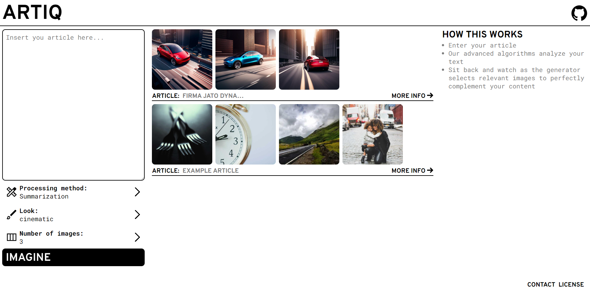

# article-image-generator
## Table of contents

- [Table of contents](#table-of-contents)
    - [About](#about)
    - [Technologies](#technologies)
    - [AI Models](#ai-models)
    - [Requirements](#requirements)
    - [Project preview](#project-preview)
- [Getting Started](#getting-started)

## About
Article image generator is a web application that generates headline images for articles. It's build on GPT-3.5, Stable diffusion XL 2.2.2 and our custom model for image validation. The application is built with Svelte and FastAPI.

### Technologies
1. Frontend: [Svelte](https://svelte.dev/) – Svelte is a modern JavaScript framework that enables the development of interactive user interfaces
2. Backend: [FastAPI](https://fastapi.tiangolo.com/) – FastAPI is a powerful Python framework for building web applications.

### AI Models
1. Image generation: [Stable diffusion XL 2.2.2](https://stability.ai/blog/stable-diffusion-public-release) – Stable diffusion XL 2.2.2 is an advanced AI model specifically designed for generating high-quality images
2. Text processing: [gpt-35-turbo](https://openai.com/blog/introducing-chatgpt-and-whisper-apis) – cutting-edge text processing model developed by OpenAI

### Requirements
1. [Python 3.9.2](https://www.python.org/downloads/) – Python serves as the primary programming language for the backend implementation.
2. [NodeJS 18.16.0 LTS](https://nodejs.org/en) – NodeJS is essential for running the Svelte frontend and managing the necessary dependencies.

### Project preview

<div style="display: flex; flex-direction: column; align-items: center; text-align: center; margin:1rem;">
  <p>Application design</p>
  <!-- FIXME: Replace for newer img -->
  
</div>
Example:
<div style="display: flex; flex-direction: column; align-items: center; text-align: center; margin:1rem;">
  <p>How Important Is Web3 and Decentralization to Industry Ecosystems?</p>
  
</div>

## Getting Started

1. Create Python virtual enviroment (optional, but will prevent some unexpected errors)

```cmd
python -m venv pyaig
```

```cmd
# Windows
pyaig\Scripts\activate
pip install -r requirements.txt
```

```cmd
# Linux
source pyaig/bin/activate
pip install -r requirements.txt
```

2. Get all svelte packages

```cmd
cd ./frontend
npm install
cd ../
```

3. Create .env file and fill it with your API keys

```env
OPENAI_API_KEY=<your key>
OPENAI_API_ENGINE=gpt-35-turbo
OPENAI_CUSTOM_DOMAIN=nextgen

STABILITY_API_KEY=<your key>

HG-Dzeniks_ACCESS_TOKEN=<your key>
```

4. Build svelte and run fastapi

```cmd
cd ./frontend
npm run build
cd ../
python -m article_image_generator.main
```

5. When first build is done, just run the python file
    - don't forget to be in virtual enviroment

```cmd
python -m article_image_generator.main
```
Optional
5. In article_image_generator.settings you can change settings of all aspects of project


Current style presets:
- realistic
- cinematic
- cartoon
- sketch
